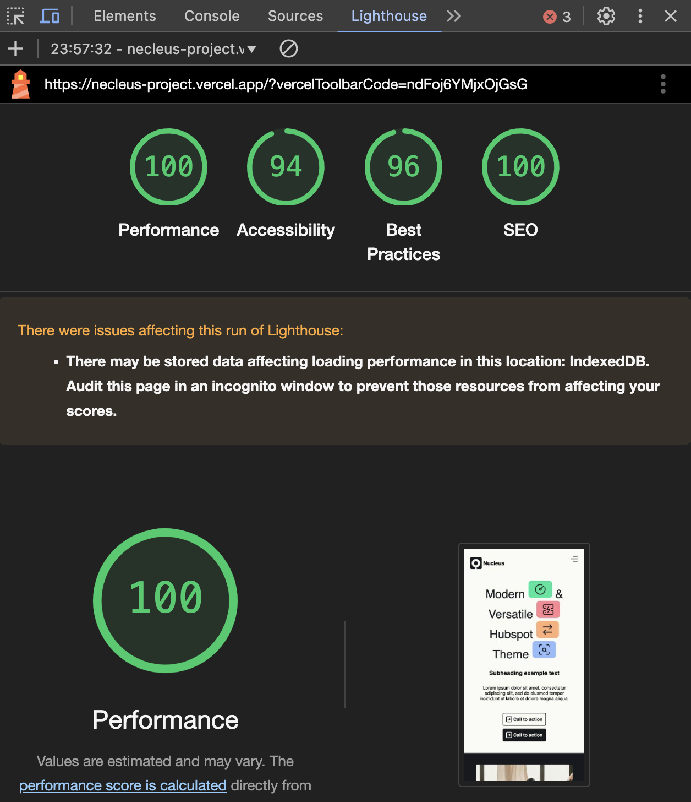

## Necleus

This is a JavaScript web application that replicates a Hubspot module.

## Features

- Optimized Images: Enhanced loading times by implementing efficient image formats and sizing.
- Responsive Design: Fully responsive layout for seamless display across all devices.
- Hamburger Menu: A modern and animated hamburger menu with smooth transitions.
- Modular Codebase: Organized code structure using SCSS and Vanilla JavaScript for easy maintenance and scalability.

## Techstack

- HTML
- SCSS
- Vanilla JS

## Steps

- Clone the repository: git clone https://github.com/yachi98/necleus-project.git

<h3>Lighthouse report</h3>

